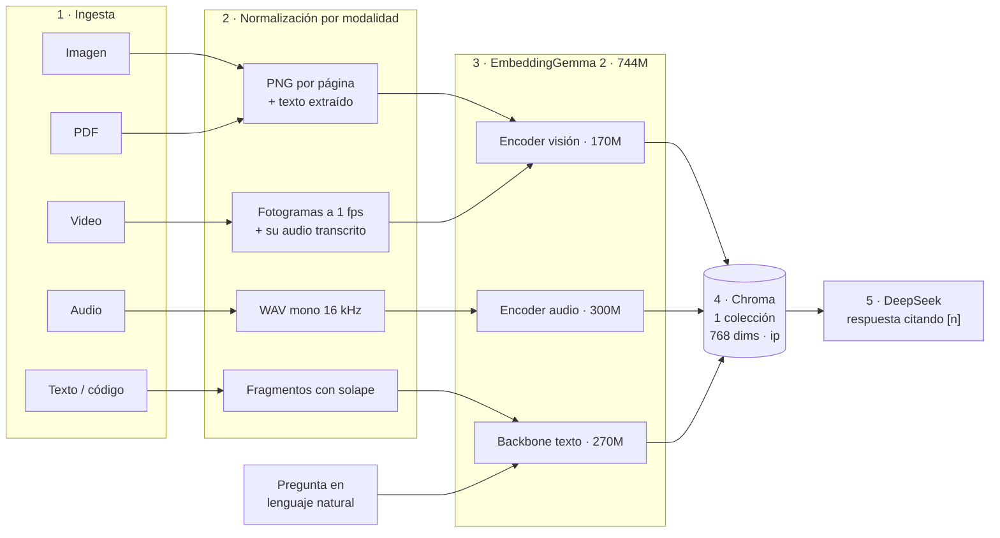
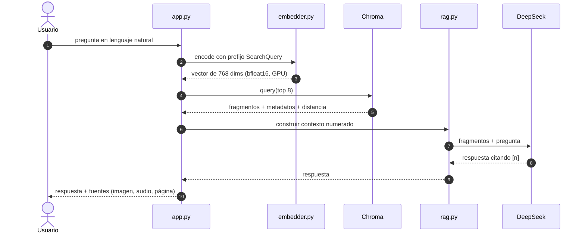

# RAG EmbeddingGemma 2

**RAG multimodal donde texto, imágenes, audio, video y páginas de PDF comparten un mismo
espacio vectorial de 768 dimensiones.** Una sola colección, una sola consulta, todas las
modalidades en el mismo ranking.


**Un motor de conocimiento empresarial multimodal, económico y local-first**, capaz de
convertir información dispersa en una memoria semántica consultable. Todo el camino de la
información —embeddings, visión, transcripción e índice— corre en el equipo: los documentos
no salen de la máquina, y al modelo externo solo viajan los fragmentos que la búsqueda
consideró relevantes.


---

## Tabla de contenido

1. [El problema que resuelve](#el-problema-que-resuelve)
2. [Qué lo hace distinto](#qué-lo-hace-distinto)
3. [Arquitectura](#arquitectura)
4. [Ciclo de vida de una consulta](#ciclo-de-vida-de-una-consulta)
5. [Resultados medidos](#resultados-medidos)
6. [Casos de uso](#casos-de-uso)
   - [La salida a la nube](#la-salida-a-la-nube-para-cuando-el-volumen-o-el-formato-no-dejen-alternativa)
   - [El patrón: local por defecto, nube como interruptor](#el-patrón-local-por-defecto-nube-como-interruptor)
7. [Por qué esto importa en la industria](#por-qué-esto-importa-en-la-industria)
8. [Proyección a futuro](#proyección-a-futuro)
9. [Puesta en marcha](#puesta-en-marcha)
10. [Configuración](#configuración)
11. [Estructura del proyecto](#estructura-del-proyecto)
12. [Decisiones congeladas y límites aceptados](#decisiones-congeladas-y-límites-aceptados)
13. [Créditos y licencias](#créditos-y-licencias)

---

## El problema que resuelve

Un RAG clásico es **text-only**. Todo lo que no sea texto tiene que convertirse primero:

- Un PDF pasa por **OCR** → pierde diagramas, tablas y maquetación.
- Un audio pasa por **transcripción** → pierde tono, ambiente y todo lo que no sea habla.
- Una foto simplemente **no entra**, o entra con metadatos escritos a mano.

Ese preprocesamiento cuesta dinero, añade latencia y **destruye exactamente la información
que hace valiosa la fuente**. Y la consecuencia práctica es que la mayor parte del
conocimiento real de una organización —informes escaneados, capturas, notas de voz,
fotografías de campo— queda fuera del alcance del asistente.

Este proyecto extrae esa conversión del pipeline: **el contenido se embebe en su modalidad
original** y se compara en un espacio común.

## Qué lo hace distinto

| RAG convencional | Este proyecto |
|---|---|
| Un índice por modalidad, o solo texto | **Una colección** para todo; la modalidad va en el payload |
| OCR para leer PDFs | El encoder de visión **codifica la página como imagen** — sin OCR, sin extraer texto |
| Transcribir audio a texto para poder buscarlo | El **audio mismo** es un vector comparable |
| Distancia coseno | **Producto punto** (`ip`): los vectores ya son unitarios, es idéntico y más rápido |
| Modelo de embeddings en la nube | **744M parámetros en local**: ~1,5 GB de VRAM, los datos no salen del equipo |

## Arquitectura



**Dos detalles que definen el diseño:**

- **Una sola colección.** No hay un índice de imágenes y otro de texto: hay uno solo, y la
  modalidad vive en el `metadata` de cada vector. Es lo que permite que una consulta
  devuelva una foto, un sonido y una página de PDF mezclados en el mismo ranking.
- **Representación dual.** El vector sale siempre de la modalidad (una página de PDF se
  embede **como imagen**), pero el campo `document` guarda el **texto** que leerá el LLM.
  Sin ese desdoblamiento, el sistema recupera bien y responde mal: al modelo de lenguaje
  solo le llegaría un nombre de archivo.

## Ciclo de vida de una consulta



La recuperación **siempre** funciona, sin API key ni llamadas externas. La generación es
opcional: sin `DEEPSEEK_API_KEY`, el paso 5 se omite y quedan los fragmentos.

## Resultados medidos

Ninguna cifra de esta sección es estimada; todas salen de ejecutar el sistema.

| Métrica | Valor medido |
|---|---|
| Parámetros del modelo | **744.371.512** (270M texto + 170M visión + 300M audio) |
| Peso en disco (bfloat16) | **1,49 GB** |
| VRAM en uso | **~1,5 GB** de 6 GB disponibles |
| Dimensión del vector | **768** (matryoshka: 512 / 256 / 128) |
| Índice de ejemplo | **47 vectores** → 20 imagen · 12 audio · 15 PDF |
| Indexado | **~10 s** para 47 vectores · **~27 s** para 147 (RTX 4050 Laptop) |
| Recuperación sola (sin LLM) | **0,115 s** de mediana sobre 6 consultas (min 0,099 · max 0,132) — medido |
| Respuesta completa | **~3-10 s** — el tiempo lo domina DeepSeek, no la GPU |
| Primer arranque de la UI | **~28 s** (carga el modelo en VRAM) |

### Línea base reproducible (el banco)

`bench/` resuelve el problema de que "parece que funciona" no es una medición. El corpus
semilla se **genera por código** (`scripts/make_bench_corpus.py`): material original del
proyecto, sin descargas, sin licencia de terceros que revisar y regenerable bit a bit.

```cmd
python scripts/make_bench_corpus.py     REM genera bench/corpus/ (14 ítems, 4 modalidades)
python scripts/bench.py                 REM mide y falla si Recall@3 baja del umbral
python scripts/bench.py --json out.json REM deja el resultado completo
```

Medido el **2026-10-09**, sobre 14 vectores y 15 consultas con respuesta conocida:

| Métrica | Valor |
|---|---|
| Recall@1 · @3 · @5 · @10 | **0,73 · 0,80 · 0,93 · 1,00** |
| MRR | **0,808** |
| Latencia de recuperación | **0,136 s** de mediana · 0,194 s p90 |
| Imagen (4 consultas) | **4/4 en el puesto 1** |
| Texto y documento (6 consultas) | **6/6 en el puesto 1** |
| Audio (4 consultas) | **0/4 en el puesto 1**, los 4 dentro del top-6 |
| Honestidad (3 consultas fuera de alcance) | **no separa** — ver abajo |

Dos lecturas que este banco deja por escrito, y que en el README eran afirmaciones sueltas:

- **La modalidad débil es el audio, y ahora tiene número.** Ninguna de las 4 consultas de
  audio acierta el puesto 1, y los 4 aciertos caen entre el #2 y el #6. Es el problema 2 de
  *Decisiones congeladas*, medido en vez de descrito.
- **La separación entre "lo tengo" y "no lo tengo" no existe por similitud absoluta.** La
  peor positiva puntúa 0,5277 y la mejor negativa 0,6167: una consulta fuera de alcance
  **puntúa más alto que una respuesta correcta**. Por eso la honestidad del sistema no puede
  depender de un umbral de similitud: depende del prompt de generación, que sí se niega
  (comprobado en la validación funcional de abajo).

**Alcance honesto:** 14 ítems generados son un *smoke test* de regresión, no un banco de
calibración. Los ítems son más fáciles de separar que una foto o una grabación de campo, así
que estos números son una **cota optimista**. Para calibrar de verdad siguen haciendo falta
~300 vectores por modalidad.

### Validación funcional

**Las consultas dependen de tus archivos, no del proyecto** — los de este repositorio son
material de ejemplo. El método es siempre el mismo, y se hace por modalidad:

1. Elige una pregunta por modalidad **cuya respuesta ya conozcas** de tus propios archivos.
2. Mira qué devuelve la recuperación: si el archivo correcto **no aparece**, falla la
   recuperación; si aparece y el LLM **no puede responder** sobre él, falla el texto.
3. Añade una pregunta fuera del alcance: lo correcto es que **se niegue**.

Para ver el ranking sin gastar una llamada al LLM:
`python scripts/check_retrieval.py "tu pregunta"`.

> ⚠️ **La tabla que sigue es histórica, no reproducible hoy.** Se midió en la primera
> semana del modelo sobre el corpus de demostración (Flickr1k + ESC-50 + arXiv), que **ya
> no está en el repositorio** y cuyos datos **no se pueden redistribuir** (ESC-50 es CC
> BY-NC, Flickr30k no declara licencia). Se conserva como registro de qué se observó
> entonces; para números que se puedan volver a correr, usa el banco de arriba.

| Bloque | Consulta de referencia | Resultado medido (2026-10-07, corpus demo ya ausente) |
|---|---|---|
| PDF | *¿Cuántas capas tiene el encoder y cuántas el decoder?* | **N=6 y N=6**, citado de la página correcta |
| PDF | *¿Por qué usaron seno y coseno en vez de embeddings posicionales aprendidos?* | Explica la extrapolación a secuencias más largas |
| Imagen | *¿Qué hace el perro blanco y negro?* | La imagen correcta en el **puesto 1**, sin filtro de modalidad |
| Audio | *¿Qué sonidos de la naturaleza tienes?* | Identifica pájaros, cuervo y tormenta, y **matiza** que el perro es animal pero no necesariamente silvestre |
| Video | *¿Qué dice el video sobre los servicios que ofrece?* | El fragmento de video en el **puesto 1** (0,7516), por delante del logo y del PDF, y responde con la narración |
| Cruce | *Busca cualquier cosa relacionada con un perro* | Imagen **#1** + audio **#2** en el mismo ranking |
| Honestidad | *¿Cuál es la capital de Francia?* | **Se niega** y explica qué contienen los fragmentos en su lugar |

Las filas de PDF, imagen, audio y cruce son del corpus de demostración; la de video, del
material propio. Por eso la tabla es **referencia de qué esperar**, no un banco de preguntas
que se pueda usar tal cual: tus archivos serán otros.

El penúltimo es el que importa: que la imagen y el audio del mismo concepto aparezcan
juntos, sin filtro, es la demostración de que **comparten espacio vectorial** y no son dos
búsquedas paralelas.

El último importa igual: un RAG que responde de más es peor que uno que responde de menos.

## Casos de uso

Donde esta arquitectura aporta algo que un RAG text-only no puede dar:

| Caso | Por qué encaja |
|---|---|
| **Archivo técnico de campo** (ingeniería, construcción, minería) | Informes PDF + fotografías de inspección + notas de voz: *"grietas en el muro norte"* devuelve la foto, el informe y la grabación juntos |
| **Evidencia y expedientes** | Documentos escaneados, imágenes y audios de entrevista en un solo índice consultable en lenguaje natural |
| **Gestión de activos multimedia** | Búsqueda semántica sobre un archivo de imágenes y audio **sin etiquetar nada a mano** |
| **Soporte técnico de producto** | Manuales, capturas de pantalla y grabaciones de incidencias bajo la misma consulta |
| **Investigación** | Papers, figuras y notas de voz: *"¿qué muestra la figura sobre atención multi-cabeza?"* |
| **Documentación interna** | Base de conocimiento corporativa que mezcla formatos y hoy nadie puede consultar entera |

### Cuándo **no** usarlo

La honestidad también es documentación:

- **Si tu corpus es solo texto**, un modelo de embeddings de texto es más pequeño, más
  rápido y más preciso. Aquí estarías pagando 300M de encoder de audio que no usas.
- **Si necesitas millones de vectores**, Chroma embebido no es la elección: hace falta un
  servidor (Qdrant, Milvus) y una estrategia de sharding.
- **Si dependes de sonidos ambientales** (no de voz), el encoder es el punto débil — ver
  [Decisiones congeladas](#decisiones-congeladas-y-límites-aceptados).
- **Si el contenido es confidencial y no puede ir a la nube**, la recuperación es local,
  pero la generación con DeepSeek no lo es. Con `DEEPSEEK_API_KEY` desactivada, el sistema
  funciona igual en modo solo-recuperación. Y si además necesitas extraer texto de
  escaneados, léelo antes en
  [La salida a la nube](#la-salida-a-la-nube-para-cuando-el-volumen-o-el-formato-no-dejen-alternativa):
  el nivel 2 hace salir el documento entero, no el fragmento.

### La salida a la nube: para cuando el volumen o el formato no dejen alternativa

**Cómo funciona hoy.** Todo es local: embeddings, visión, transcripción e índice. La nube se
usa **solo para redactar respuestas** a partir de los fragmentos recuperados.

**Qué se midió el 2026-10-09, y por qué está aquí.** Los casos de la tabla de arriba que hoy
no se cubren —un escaneado sin capa de texto, un archivo de miles de páginas— **no están
bloqueados por la arquitectura**. Están bloqueados por una decisión reversible. La prueba:

> El modelo de visión **local ya extrae texto completo**, pero se le pide que **describa en
> una o dos frases**. Medido sobre una página renderizada de un PDF real: con el prompt
> actual devuelve **243 caracteres** (12% del texto de la página); pidiendo la transcripción
> completa devuelve **2.059 (98%) con 99% de cobertura de palabras**, y **tarda menos**
> (11,4 s frente a 15,5 s). No es capacidad que falte: es un prompt que limita.

Y si el formato o el volumen siguen sin caber, `deepseek-flash` **acepta imágenes** —su
documentación lo confirma y está verificado contra el API—, con estas cifras medidas en la
misma página:

| Motor | Latencia | Texto extraído | Cobertura de palabras | Coste por página |
|---|---|---|---|---|
| Visión **local** (`gemma4:e2b`) | 11,4 s | 2.059 car. (98%) | **99%** | **$0** |
| **DeepSeek** Vision (nube) | **3,8 s** | 2.114 car. (101%) | 95% | **$0,000540** |

**Calidad: empate.** La nube es 3× más rápida y no consume VRAM; el local gana en cobertura
y no cuesta. A escala, la nube cuesta **$0,54 por 1.000 páginas** y **$10,80 por 20.000**:
extraer una documentoteca entera escaneada sale por el precio de un café.

**Dos límites del coste, medidos.** Las imágenes tienen un tope de **1.024 tokens** cada una,
así que el coste **no depende del tamaño de la imagen**; y el prompt sí importa: una consulta
de una palabra gastó **8.293 tokens de salida, 8.291 de ellos de razonamiento**. El coste se
controla con el prompt, no con la resolución.

**El precio que se paga por esa salida.** Mandar una imagen a la nube hace que el documento
**salga del equipo entero**, no el fragmento. Eso rompe la promesa central de este proyecto y
lo hace precisamente en los dos casos que más la necesitan: *evidencia y expedientes* y
*archivo técnico de campo* son, por definición, datos que no se suben. **La decisión es del
cliente, no del proyecto.**

### El patrón: local por defecto, nube como interruptor

Se documenta como **proyección medida**, no como funcionalidad instalada: el mecanismo está
verificado y las cifras son reales, pero **la app no lo expone todavía**. Encenderlo no
requiere arquitectura nueva, porque `describe.describe_image()` **ya** envía base64 a un
endpoint por HTTP — es cambiar el destino y el payload:

| Nivel | Motor | Cuándo | Coste |
|---|---|---|---|
| **1 · Local** | `gemma4:e2b` + Whisper (por defecto) | Siempre. Confidencial, sin red, sin coste | $0 |
| **2 · Nube** | `deepseek-flash` con imagen, **opt-in** | Corpus no sensible, o volumen que no cabe en la GPU | $0,000540 / página |

Es **el mismo patrón que ya usa la generación**: si `DEEPSEEK_API_KEY` no está definida, todo
funciona en local y sin llamadas externas. Se extiende a la ingesta sin inventar nada nuevo.

**Cómo se implementaría** (borrador, no verificado end-to-end):

```cmd
REM  En .env, junto a las variables de visión que ya existen:
VISION_MODEL=gemma4:e2b                    REM nivel 1, por defecto
VISION_CLOUD_FALLBACK=deepseek-flash       REM nivel 2, vacío = nunca sale a la nube
VISION_PROMPT=extraccion                   REM `descripcion` (1-2 frases) | `extraccion`
```

Con tres reglas que la implementación debe respetar:

1. **El destino por defecto es local.** La nube no se activa por olvido ni por herencia del
   entorno, sino por una variable explícita.
2. **La app avisa antes de enviar.** Un aviso visible al indexar, no una nota en el README:
   quien sube un expediente tiene derecho a saber que sale del equipo.
3. **El texto extraído se revisa.** `gemma4:e2b` transcribió mal una cifra en la prueba
   (`3028577491` por `3217199749`). El panel **Textos para revisar** ya existe para esto y
   es obligatorio, no opcional.

| Caso de uso | Nivel 1 (local) | Nivel 2 (nube) |
|---|---|---|
| Archivo técnico de campo | Con extracción completa | Solo si el cliente lo autoriza |
| Evidencia y expedientes | Con extracción completa | **Normalmente no**: es el caso más sensible |
| Gestión de activos multimedia | **Ya funciona** | No hace falta |
| Soporte técnico de producto | Con extracción completa | Manuales no confidenciales: buen candidato |
| Investigación (figuras) | **No cubierto** | Tampoco: transcribir un diagrama no es interpretarlo |
| Documentación interna | Con extracción completa | Miles de páginas: aquí el nivel 2 paga |

> **Lo que ninguna de las dos vías resuelve:** *"¿qué muestra la figura sobre atención
> multi-cabeza?"*. Transcribir los ejes de un diagrama no es interpretarlo. Ese caso necesita
> un modelo que razone sobre la relación entre elementos, y **no está medido**.

## Por qué esto importa en la industria

Tres razones técnicas, sin extrapolaciones de mercado:

**1 · La mayoría del conocimiento empresarial no es texto.** PDFs escaneados, fotografías,
grabaciones. Un RAG text-only deja fuera todo eso o lo degrada vía OCR/ASR, que son
pérdidas irreversibles: el OCR aplana diagramas y tablas, la transcripción borra el tono y
el ambiente.

**2 · El preprocesamiento es el costo oculto.** Cada página OCR y cada minuto transcrito es
una llamada a un servicio externo. Embeber en la modalidad original elimina esa capa
completa: no hay OCR que pagar por página ni ASR que pagar por minuto. Y cuando el formato
sí exige extraer el texto, la vía **local** lo hace sin salir del equipo — ver *La salida a
la nube* para qué cuesta cada opción y qué se paga a cambio.

**3 · Un modelo de 744M cabe en un portátil.** Eso cambia dónde puede correr un RAG
multimodal: no es un servicio de nube, es una aplicación local. Para sectores donde los
datos no pueden salir del equipo, la diferencia entre "1,5 GB en tu GPU" y "súbelo a la
API" no es una preferencia de diseño, es un requisito legal.

**El contrapeso:** el modelo salió el **2026-10-06**, es decir que esta arquitectura se está
construyendo sobre tecnología de días, no de años. Las mediciones de este README son de la
primera semana de vida del modelo y pueden moverse con sus actualizaciones.

## Proyección a futuro

**El norte.** *Cualquier información empresarial, independientemente de su formato, debe
poder convertirse en conocimiento semánticamente recuperable y ser consultada mediante
lenguaje natural.*

Es la **dirección**, no un estado alcanzado: hoy el motor cubre cinco modalidades en un
mismo ranking —texto, imagen, audio, PDF y video— y lo de abajo separa lo que los datos ya
piden de lo que es hipótesis.

**Lo que los datos ya piden** (cada uno con su justificación en las mediciones):

| Siguiente paso | Qué lo justifica |
|---|---|
| **Escalar a ~300 vectores por modalidad** | Es el mínimo para poder validar una calibración por modalidad sin sobreajustar (hoy hay 12 audios) |
| **Migrar a un servidor vectorial** (Qdrant, Milvus) | Cuando el corpus deje de caber en memoria y haga falta filtrado e híbrido de verdad |

**Hacia dónde apunta el modelo:** EmbeddingGemma 2 trae Matryoshka (128 dims para reducir
el índice **6×**) y un backbone de texto de 270M cargable sin los encoders de visión y
audio. Eso habilita un patrón concreto: **indexar una vez en el servidor con el modelo
completo y consultar desde el dispositivo con el modelo pequeño**, porque comparten espacio.
Es el camino natural para llevar esto a móvil.

> Estas proyecciones son hipótesis de trabajo, no compromisos. La versión actual está
> **congelada a propósito**: ver la sección siguiente antes de proponer cambios.

## Puesta en marcha

Requiere el entorno conda `EmbeddingGemma2` (ver `requirements.txt`).

```cmd
conda activate EmbeddingGemma2

REM 1) datos demo: audio + PDF (rápido, ~4 MB)
python scripts/seed_demo.py

REM    o con fotos: + 20 imágenes de Flickr1k (140 MB, se descargan la primera vez
REM    y quedan en data/_cache/flickr.zip: nada de eso se versiona en el repo)
python scripts/seed_demo.py --images 20

REM 2) interfaz
streamlit run app.py

REM    Dos pestañas: Preguntar (respuesta citada) y Recuperar (el ranking con sus
REM    similitudes y el Top-K ajustable, sin capa de generación ni gasto de tokens)
```

La primera ejecución descarga el modelo **`google/embeddinggemma-2`** (~1,5 GB en bfloat16)
desde Hugging Face. No requiere token: el modelo no está restringido.

## Configuración

```cmd
copy .env.example .env
```

| Variable | Obligatoria | Qué hace |
|---|---|---|
| `DEEPSEEK_API_KEY` | No | Activa la generación de respuestas. Sin ella, solo recuperación |
| `AI_MODEL` | Si hay key | Modelo de lenguaje. El nombre vigente es **`deepseek-flash`** |
| `AI_MODEL_BASE_URL` | Si hay key | Endpoint compatible con OpenAI (`https://api.deepseek.com`) |
| `MODEL_ID` | No | Modelo de embeddings (por defecto `google/embeddinggemma-2`) |
| `EMBED_DIM` | No | 768 (nativo), 512, 256 o 128. Cambiarlo exige borrar `chroma_db/` |
| `VISION_MODEL` | No | Modelo de Ollama que describe cada imagen al indexarla (p. ej. `gemma4:e2b`) |
| `VISION_BASE_URL` | No | Endpoint de Ollama (p. ej. `http://localhost:11434`) |
| `WHISPER_MODEL` | No | Modelo de Whisper para transcribir audio (p. ej. `small`; vacío lo desactiva) |
| `WHISPER_DEVICE` | No | `cpu` (por defecto) o `cuda` (exige las DLLs de CUDA de ctranslate2) |
| `WHISPER_LANGUAGE` | No | Idioma fijo de la transcripción — **no** se autodetecta |
| `TOP_K` | No | Cuántos fragmentos recupera cada consulta (por defecto 8) |

El `.env` es la única fuente de verdad: **no hay valores por defecto escondidos en el
código** para la capa de generación. Si defines la key, el modelo y la URL pasan a ser
obligatorios, y la app lo exige con un error claro en vez de fallar en silencio.

## Estructura del proyecto

```
Embedding_Gemma2/
├── app.py                       Interfaz Streamlit (pregunta → respuesta → fuentes)
├── requirements.txt             Dependencias verificadas contra PyPI
├── requirements-dev.txt         Solo para desarrollo: pytest
├── .env.example                 Plantilla de configuración
├── conftest.py                  Aislamiento de Chroma y raíz importable
├── docs/                        El notebook de Colab del que nació el proyecto
├── bench/                       El banco de validación (ver *Línea base reproducible*)
│   ├── corpus/                  Corpus semilla CC0, generado por código
│   ├── labels.json              Texto con el que se embebe cada ítem + su licencia
│   ├── queries.yaml             Consultas con respuesta conocida y negativas
│   └── .index/                  Índice del banco, aparte del de trabajo (ignorado por git)
├── tests/                       La suite de regresión (154 tests, 4 se saltan)
│   ├── test_store.py            ⭐ Distancia→similitud, espacio ip, filtro, conteos
│   ├── test_ingest.py           Representación dual, normalización de imágenes, fragmentado
│   ├── test_video.py            Fragmentado, muestreo a 1 fps, reescalado y audio del video
│   ├── test_describe.py         Descripciones locales: think=False, no pisar lo revisado
│   ├── test_rag.py              Numeración de las citas y validación del cliente
│   ├── test_bench.py            ⭐ El banco y el parche del decodificador de audio
│   ├── test_config.py           Cuándo se activa la generación
│   ├── test_embedder.py         La regla de float16
│   └── test_seed_demo.py        Etiquetas de texto del demo
├── src/
│   ├── config.py                Todo lo configurable, leído del .env
│   ├── embedder.py              Carga el modelo una vez; texto con prefijo, media sin él
│   ├── store.py                 Chroma: una colección, modalidad en el payload, distancia ip
│   ├── ingest.py                Normaliza por modalidad y guarda texto + vector
│   ├── video.py                 PyAV: fotogramas a 1 fps, audio a 16 kHz, fragmentado
│   ├── describe.py              Texto de imágenes (visión local), audio y video (Whisper)
│   └── rag.py                   Recuperación + generación con citas
├── scripts/
│   ├── make_bench_corpus.py     Genera el corpus semilla (determinista, sin red)
│   ├── bench.py                 Mide Recall@K, MRR, separación y latencia
│   ├── seed_demo.py             Datos de ejemplo y sus etiquetas de texto
│   └── check_retrieval.py       Verificación de la búsqueda cruzada, sin LLM
├── data/                        Datos demo (ignorado por git)
└── chroma_db/                   Índice vectorial persistente (ignorado por git)
```

## Tests

```cmd
pip install -r requirements-dev.txt
pytest -q
```

**154 tests: 150 pasan y 4 se saltan, en ~32 s.** No buscan cobertura decorativa: protegen
las **cosas del sistema que fallan en silencio**, es decir las que nadie notaría hasta que
un usuario recibiera una respuesta peor sin saber por qué.

| Qué protege | Test | Qué pasaría sin él |
|---|---|---|
| `similitud = 1 − distancia` | `test_vector_opuesto_da_similitud_menos_uno` | Un signo invertido ordena el ranking **al revés**, sin lanzar error |
| `float16` prohibido | `test_la_precision_nunca_es_float16` | `NaN` o embeddings degradados **sin aviso** |
| El texto de la página llega al LLM | `test_pdf_pages_devuelve_imagen_y_texto` | El RAG recuperaría bien y respondería *"no lo sé"* a todo |
| Las citas apuntan al fragmento correcto | `test_el_contexto_numera_desde_uno` | El LLM citaría **el archivo equivocado** |
| La transparencia se compone sobre blanco | `test_image_to_rgb_conserva_el_contenido_y_blanquea_el_fondo` | Un logo con fondo transparente se embebe **negro** y nadie lo nota |
| El razonamiento se apaga al describir | `test_el_payload_apaga_el_razonamiento` | Cada imagen tardaría **100 s en vez de 5** |
| El decodificador de audio llega a las **dos** puertas del parche | `test_el_parche_de_audio_esta_en_las_dos_puertas` | Toda la ingesta de audio falla en silencio (ver *Decisiones congeladas*) |
| El remuestreo del video no usa librosa | `test_el_remuestreo_del_video_no_usa_librosa` | Un video nuevo no se puede ni transcribir ni embeber |
| El banco de validación es coherente | `tests/test_bench.py` (7 tests) | El banco mediría cero y parecería que el sistema falla |

Los 4 que se saltan son de `seed_demo` y del corpus del banco: dependen de descargas de red
o de que `bench/corpus/` esté generado, y se saltan en lugar de fallar.

> **Nota de entorno.** `pytest` necesita escribir temporales. Bajo un sandbox que deniegue
> los permisos de `%TEMP%`, los tests que usan `tmp_path` fallan con `PermissionError` y el
> resultado no dice nada del código. Si ves decenas de errores de permiso seguidos, es el
> entorno, no el proyecto.

### Qué NO se testea (a propósito)

| Excluido | Motivo |
|---|---|
| `embedder.encode_text` / `encode_media` | Exigen cargar los 744M de parámetros: 1,5 GB y ~10 s por sesión. Es integración, no unidad |
| `rag.retrieve` y `rag.answer` con fragmentos | Requieren modelo **y** API de DeepSeek: coste real por test |
| `app.py` (Streamlit) | Necesitaría mockear el runtime; ya lo cubre la validación funcional con `AppTest` |
| `seed_demo.seed_*` | Descargas de red |

Los tests **no tocan código de producción**: el aislamiento de Chroma se hace con
`monkeypatch` sobre `config.CHROMA_DIR` y `store._client`, activo solo mientras dura
el test y sin efecto alguno sobre la aplicación.

> **Nota técnica:** los tests usan un directorio de Chroma distinto por test, no
> `EphemeralClient()`. Chroma comparte una única instancia en memoria entre clientes,
> así que con el cliente efímero los vectores **se filtraban de un test a otro** y los
> conteos crecían. Un directorio propio por test aísla de verdad y además ejercita el
> mismo `PersistentClient` que usa la aplicación.

## Decisiones congeladas y límites aceptados

**Estado:** validado de punta a punta (5/5 bloques) el 2026-10-07 y **congelado a propósito**
en esta versión. Lo de abajo no son tareas pendientes: son cosas evaluadas y **rechazadas a
conciencia**, con el dato que lo justifica. Si vas a "mejorar" algo, empieza por aquí.

### Los tres problemas conocidos, y por qué no se arreglan

**1 · Redundancia intra-documento.** Una pregunta sobre el paper trae 8 páginas del mismo
archivo: 23.253 caracteres enviados al LLM y 1.826 aprovechados → **92% de contexto
desperdiciado** (ese documento es el 32% del índice).

> *Arreglo propuesto:* corte por similitud relativa (quedarse solo con los fragmentos cerca
> del mejor puntaje). **Rechazado** porque el ahorro es de **$0.0006 por pregunta** (~$1/mes
> a 50 diarias, a tarifas de `deepseek-flash`) y el factor no tiene valor fundamentado: con
> `×0.95` deja **1 fragmento** en una pregunta y **8** en otra. Y un corte solo puede quitar,
> nunca añadir, así que tampoco arregla el problema 3.

**2 · El audio tiene un piso alto y plano.** Los 12 clips puntúan entre 0,58 y 0,63 pase lo
que pase: `chainsaw` es el **#1** para *"fuegos artificiales"*, *"avión"* y *"palmas"*. Su
banda mide 0,054-0,086 de ancho, frente a 0,152 del PDF cuando es relevante — por eso el
audio no discrimina y el PDF sí acierta la página.

> *Arreglo propuesto:* calibrar por modalidad (z-score dentro de cada una y fusionar).
> **Rechazado** porque con 12 muestras no se puede distinguir una mejora real de un
> sobreajuste a estos 12 audios concretos. Haría falta un corpus de ~300+ vectores por
> modalidad antes de poder validar el cambio.

**3 · `fireworks` es inalcanzable por su nombre.** Preguntando *"¿tienes un sonido de fuegos
artificiales?"* queda en el puesto **11**: el sistema responde "no tengo" y **miente**.

> *Arreglo propuesto:* embeber la etiqueta como segundo vector del archivo. **Rechazado**
> porque duplica los assets en el ranking, desbalancea la competición (los 32 items de media
> tendrían 2 vectores frente a 1 por cada página del PDF) y **diluye el valor probatorio del
> demo**: los aciertos pasarían a ser emparejamiento texto-texto. La alternativa léxica
> (`where_document={"$contains": ...}`) solo dispara con la palabra literal, y las etiquetas
> están en inglés mientras se pregunta en español.

### Y no simplifiques esto

| Invariante | Qué rompe si lo quitas |
|---|---|
| **Representación dual** del PDF: imagen para recuperar + texto de la página para el LLM | Sin el texto, al LLM solo le llega `'attention.pdf · página 3'` y **no puede responder nada** sobre el contenido |
| **Una sola colección** de Chroma, con la modalidad en el payload | Es lo que hace que una consulta devuelva fotos, audios y páginas mezclados en un mismo ranking |
| **Un solo vector** *interleaved* cuando hay texto (imagen, audio o video) | El texto y la modalidad van en el MISMO vector, no en dos: un segundo vector duplicaría el archivo en el ranking. Medido el 2026-10-08 — sin la forma interleaved, una consulta sobre lo que **dice** el video lo dejaba en 0,6521; con ella, en **0,7516** y en el puesto 1 |
| **La huella decide si un vector se re-embebe** | Es lo que hace barato reindexar: se guarda `huella = hash(versión del archivo + texto)` y lo que no cambió no se vuelve a preparar. Medido el 2026-10-08 — reindexar sin cambios pasó de **40,6 s a 0,69 s** (14 de 17 vectores intactos) y corregir una palabra de la transcripción del video, de 29 s a **6,6 s**. Quitarla «simplificando» devuelve el coste entero sin que nada falle |
| `load_dotenv(..., override=True)` | Hay una `DEEPSEEK_API_KEY` de otro proyecto en el entorno del sistema; sin el override se cuela en silencio |
| Texto **con** prefijo de tarea, media **sin** prefijo | Lo exige el modelo, no es estilo |

### Un fallo de entorno que puede romper la ingesta de audio y de video

**No es un límite aceptado: es un bug de dependencia, encontrado el 2026-10-09.** `librosa`
1.0.0 no puede compilar sus funciones en este entorno —`numba` no encuentra el fichero
fuente del módulo—, así que **cualquier** llamada a su API falla:

```
RuntimeError: cannot cache function '__o_fold': no locator available for
file .../librosa/core/notation.py
```

Aparece de forma **determinista**: se reproduce con la caché de numba limpia, con
`NUMBA_CACHE_DIR` vacío y con `NUMBA_DISABLE_JIT=1` (que da otro error del mismo tipo,
`_zc_wrapper`). No se ha identificado la causa última; lo que está medido es que ocurre.

**Cuándo muerde, y esto importa más que el error:** solo cuando el modelo tiene que
**volver a embeber** audio o video. En una reindexación donde la huella no cambió, el
camino ni se ejecuta. Medido el 2026-10-09 sobre los 13 archivos reales: reingerir todo
dio **17 vectores intactos, 0 errores** — el fallo no se manifestó porque no había nada
que reembeber. Es exactamente el mecanismo que protege el salto por huella, y también la
razón de que este bug pudiera pasar desapercibido durante días.

`librosa` está en la ruta crítica **dos veces**, y son dos caminos distintos que conviene
no confundir:

| Camino | Qué hace con el audio | Quién decodifica |
|---|---|---|
| **Embeddings** (`src/ingest.py`, `src/embedder.py`) | audio → **vector** de 768d | `transformers.audio_utils.load_audio()` → llamaba a `librosa` |
| **Embeddings de video** (`src/video.py`) | pista de audio del video → 16 kHz | `librosa.resample()` |
| **Transcripción** (`src/describe.py`) | audio → **texto** | `faster-whisper` (PyAV), Whisper. **Nunca usó librosa** |

Las tres filas se cruzan: un video se transcribe con Whisper **y** se embebe con
`video.audio_16k_mono()`, así que un video nuevo dependía de librosa aunque la
transcripción no.

El arreglo son dos sustituciones, ninguna con dependencias nuevas (`scipy` ya venía):

1. `ingest.audio_to_16k_mono()` decodifica con **soundfile** y remuestrea con
   `scipy.signal.resample_poly`. `librosa` queda solo como respaldo por formato.
2. `video.audio_16k_mono()` remuestrea con `scipy.signal.resample_poly`.
3. `embedder._audio_sin_librosa()` sustituye `transformers.audio_utils.load_audio` por un
   decodificador equivalente. **Hay que parchear dos puertas**, y ahí estaba la trampa:
   `transformers.processing_utils` importó el nombre (`from .audio_utils import load_audio`),
   así que conserva su propia referencia. Parchear solo `audio_utils` parece funcionar en
   una llamada directa y deja el pipeline roto.

Medido antes y después, sobre el corpus del banco: **sin el arreglo, 9 de 14 vectores** se
indexaban y las 5 pistas de audio se perdían con `RuntimeError`; **con el arreglo, 14 de 14**.
Verificado además sobre material real: el MP3 de 111 s y el video de 74,83 s (1.198.080
muestras a 16 kHz). Hay 7 tests protegiendo las dos puertas del parche y los dos remuestreos.

### Tres notas menores

- `AI_MODEL=deepseek-v4-flash` es un **nombre legacy de un modelo retirado**, pero **no está
  roto**: DeepSeek acepta el alias y redirige la petición. Medido el 2026-10-07 — pidiendo
  `deepseek-v4-flash`, la respuesta del API trae `"model": "deepseek-flash"`, o sea que quien
  sirve es el modelo vigente. Conviene migrar el nombre porque un alias de compatibilidad se
  retira **sin aviso**, y entonces la app fallaría sin que nada cambie de tu lado. El cambio
  es **de riesgo bajo, no de riesgo cero**: ambos nombres llegan hoy al mismo modelo, pero
  "hoy" es la única garantía que hay.
- **El PDF no participa en el salto por huella**, a propósito: renderizar y extraer sus
  páginas cuesta **0,87 s** medidos (3 páginas), y saltarlo obligaría a separar la
  extracción de texto del renderizado. Es la única modalidad que se re-embebe siempre.
- **El video no necesita instalar nada**: se decodifica con **PyAV**, que trae FFmpeg
  **embebido** y ya llega con `faster-whisper` — sin `torchcodec` ni ffmpeg del sistema.
  La vía nativa de `transformers` no sirve: su `fetch_videos()` fuerza
  `backend="torchcodec"` y, sin él, cae a `torchvision`, donde `read_video` se eliminó en
  0.26.0. Y el modelo **no decodifica video** —mira fotogramas del encoder de visión a
  1 fps—, así que se le entregan ya muestreados y `load_video()` sale temprano. Su texto
  sale de **transcribir su audio** (una pasada de Whisper para todo el archivo, 3,5 s
  medidos con 75 s), no de describir fotogramas: medido, describirlos costaba ~4 s por
  fragmento y solo aportaba generalidades.
- **El audio se transcribe en local** con `faster-whisper` (CPU, idioma **fijo**) desde el
  2026-10-07, igual que las imágenes se describen: un audio pasó de **encontrarse** a
  **responderse**. Ollama NO sirve para esto —solo acepta `audio` en `/api/embed`—, y hay
  una trampa que costó un diagnóstico: si se le pasa la **ruta** del archivo, `faster-whisper`
  lo decodifica con PyAV y revienta (`metadata_errors` no existe en el PyAV que trae
  `transformers[video]`); se le pasa el **array** ya en 16 kHz mono y no toca PyAV.

### Cómo re-validar tras cualquier cambio

**Primer nivel, automático.** `pytest -q` corre los 141 tests de lógica en ~22 s, sin
modelo ni red. Si algo del andamiaje se rompe, el test lo dice antes que un usuario.

**Segundo nivel, comportamiento.** Con **tus** archivos y el método de *Validación
funcional*: una pregunta por modalidad cuya respuesta ya conozcas. Dos comprobaciones no
dependen del corpus y conviene hacerlas siempre:

| Qué | Pregunta | Resultado esperado |
|---|---|---|
| Honestidad | `¿Cuál es la capital de Francia?` | **se niega** a responder |
| Límite del video | `¿Qué se ve en el video?` | **admite que no puede**: los fragmentos traen su transcripción, no lo visual |

Recuperación sola, sin LLM y con tus consultas: `python scripts/check_retrieval.py "…"`.

## Créditos y licencias

**Modelo:** [`google/embeddinggemma-2`](https://huggingface.co/google/embeddinggemma-2) —
Google DeepMind, 744M parámetros, del 2026-10-06. Licencia **Apache 2.0**.
Cargado con [sentence-transformers](https://www.sbert.net/) 6.1.0.

**Documentación oficial:**
[Transformers · `EmbeddingGemma2Model`](https://huggingface.co/docs/transformers/main/en/model_doc/embedding_gemma2#transformers.EmbeddingGemma2Model)

**Notebook de origen:**
[`docs/embeddinggemma2_multimodal_retrieval.py`](docs/embeddinggemma2_multimodal_retrieval.py) —
el demo de Colab del que partió el proyecto, conservado como documentación (ver
[`docs/README.md`](docs/README.md)). Conviene decir sus límites antes de leerlo: **solo
recupera**, nunca tuvo capa de generación, y la aparente «visión» de sus fotos venía de los
**captions del dataset**, no del modelo.

**Datos de ejemplo:**

| Fuente | Contenido | Licencia |
|---|---|---|
| [Flickr30k 1k test](https://huggingface.co/datasets/nlphuji/flickr_1k_test_image_text_retrieval) | 20 fotografías con caption | **El dataset no declara licencia**: las fotos vienen de Flickr con licencias individuales, así que hay que revisarlas por foto antes de un uso comercial |
| [ESC-50](https://github.com/karolpiczak/ESC-50) | 12 sonidos ambientales, un clip por clase | **CC BY-NC 3.0 — no comercial** |
| [*Attention Is All You Need*](https://arxiv.org/abs/1706.03762) | 15 páginas del paper original | arXiv |

> ⚠️ **Aviso:** ninguna de las dos fuentes de medios puede formar parte de un producto con
> fines de lucro sin revisarla: los audios de ESC-50 son **no comerciales** y las fotos de
> Flickr30k **no declaran licencia**. Para un uso propio, cualquiera de las cuatro
> modalidades admite tus archivos sin depender de estos ejemplos.

**Motor vectorial:** [Chroma](https://www.trychroma.com/) 1.5.9 (Apache 2.0).
**Interfaz:** [Streamlit](https://streamlit.io/) 1.65.0.
**Generación opcional:** [DeepSeek](https://www.deepseek.com/) vía API compatible con OpenAI.

**Licencia del código de este proyecto:** por definir por el autor.
